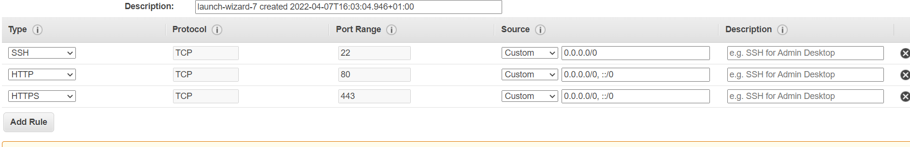
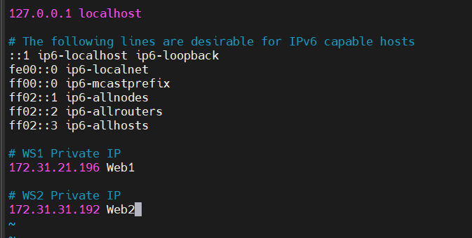
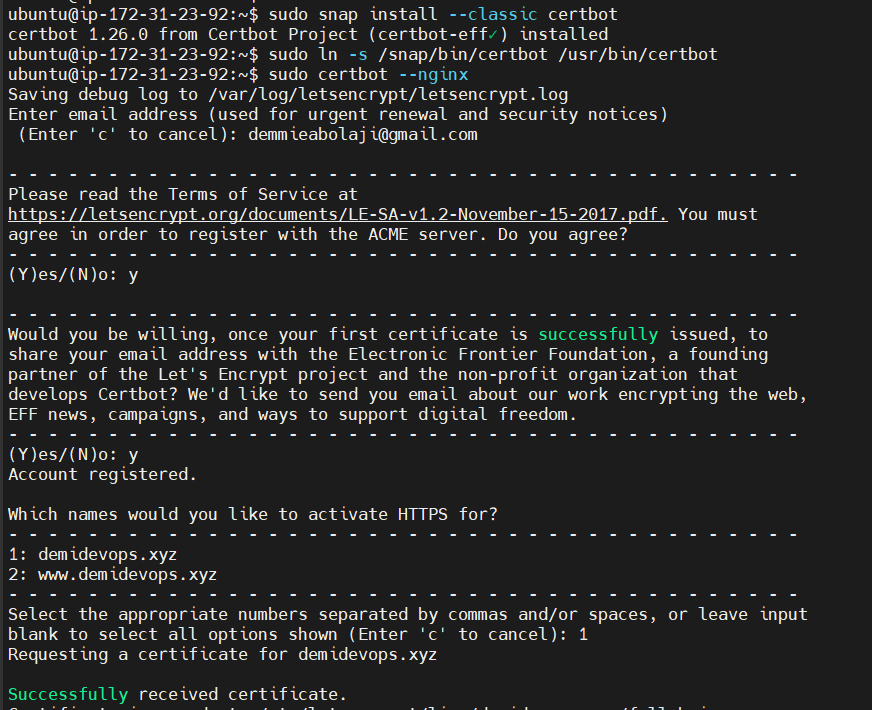
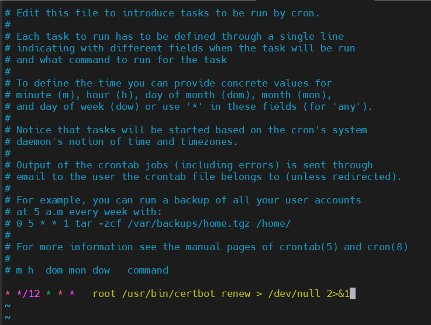

## configuring nginx as a load balancer

created an ec2 instance for nginx, opened tcp port 80 and tcp port 443 with inbound access from anywhere

updating ubuntu

`$ sudo apt update -y`

updating /etc/hosts file for local dns with web servers and their ip address

installing nginx on ubuntu

`$ sudo apt install nginx -y`

editing nginx default configuration file

`$ sudo vi /etc/nginx/nginx.conf`

confirming nginx's status

`$ sudo systemctl restart nginx`

`$ sudo systemctl status nginx`

registered a domain name and assigned an elastic ip to my nginx server

updated A record, configured it on route 53 and on /etc/hosts

!

`$ sudo systemctl restart nginx`

`$ sudo systemctl status nginx`

testing that web servers can be accessed via web browser using http protocol

confirming snapd service is active and running

`$ sudo systemctl status snapd`

installing certbot to request an ssl/tls certificate

`$ sudo snap install --classic certbot`

`$ sudo ln -s /snap/bin/certbot /usr/bin/certbot`

`$ sudo certbot --nginx`

testing web server via https protocol

setting up periodical renewal of ssl/tls certificate

`$ sudo certbot renew --dry-run`

`$ crontab -e`

added this line to vim

`* */12 * * *   root /usr/bin/certbot renew > /dev/null 2>&1`

